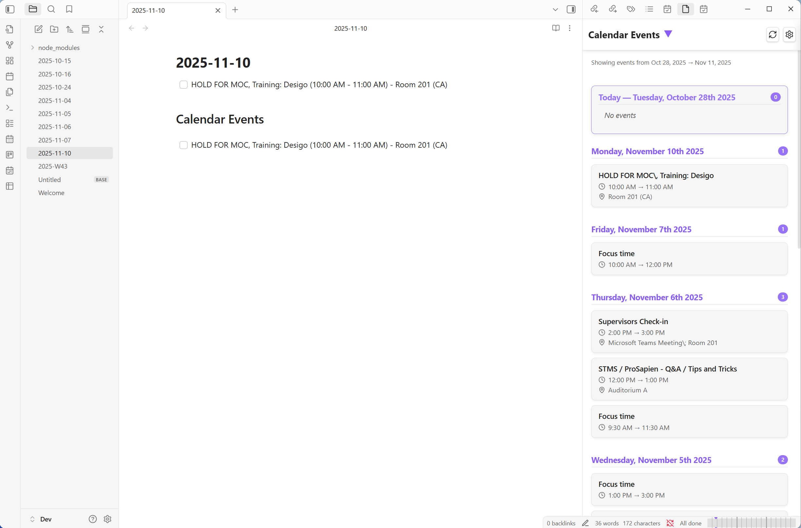
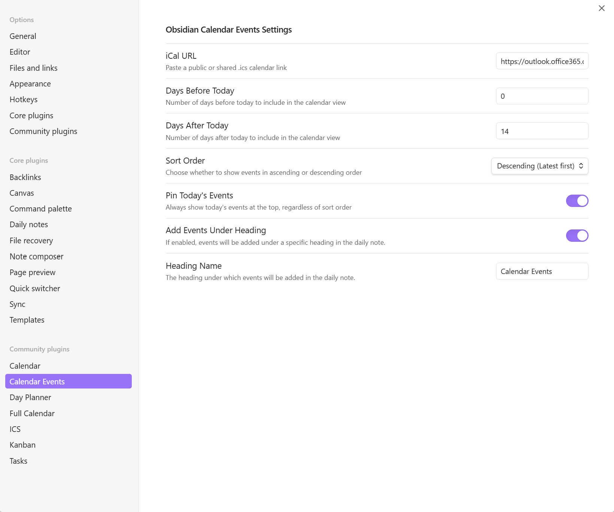

# Obsidian Calendar Events

<p align="center">
  <a href="https://github.com/ArctykDev/obsidian-calendar-events/releases">
    
  </a>
  <a href="https://github.com/ArctykDev/obsidian-calendar-events/actions/workflows/build.yml">
    
  </a>
  <a href="https://github.com/ArctykDev/obsidian-calendar-events/blob/main/LICENSE">
    
  </a>
</p>


A lightweight Obsidian plugin that displays events from an **iCal (ICS)** feed directly inside Obsidian.  

Designed for seamless integration with external calendar feeds such as Outlook, Google Calendar, or SharePoint calendar ICS links.

View previous versions and full changelog [CHANGELOG.md](CHANGELOG.md).

### Calendar View



### Settings View




---

## ✨ Features

- 📅 View upcoming events from any iCal (.ics) feed inside Obsidian  
- 🗓️ Events automatically grouped and sorted by day
- 🗓️ Pin today's events to the top of the event list
- 🗓️ Click on event to add it to daily note  
- ⏱️ Configurable date range to control how far ahead events are displayed  
- ⚙️ Simple settings panel for configuration  
- 💡 Works entirely offline once data is fetched — no external dependencies beyond the Obsidian API

---

## 🧩 How It Works

This plugin reads events from a provided iCal (ICS) URL and displays them in a dedicated Obsidian view. 

Events are parsed, grouped by date, and presented in a clean, readable layout inside the app.

---


## 🛠 Installation

### Option 1: Install via BRAT (Recommended for testing)

You can easily install this plugin using the BRAT (Beta Reviewers Auto-update Tester)
 plugin:

1. Install and enable BRAT in Obsidian.
2. Open the BRAT settings panel.
3. Add this repository using the GitHub URL:

   ```bash
   ArctykDev/obsidian-calendar-events
   ```
4. BRAT will automatically download and update the plugin whenever new versions are released.

### Option 2: Manual installation

1. Download the latest release from the Releases page.
2. Extract the archive into your vault’s plugin folder:

   ```bash
   .obsidian/plugins/obsidian-calendar-events/
   ```
3. Ensure the folder contains the following files:

   ```bash
   main.js
   manifest.json
   styles.css (if applicable)
   ```
4. Reload Obsidian and enable SharePoint Calendar Events from the community plugins list.

### Option 3 — Manual (Developer)

1. Clone or download this repository:
   ```bash
   git clone https://github.com/YOUR-USERNAME/obsidian-calendar-events.git
   ```
2. Navigate to the plugin directory:

   ```bash
    cd obsidian-calendar-events
   ```
3. Install dependencies:

   ```bash
    npm install
   ```
4. Build the plugin:

   ```bash
    npm run build
   ```
5. Copy the following files to your vault’s plugin folder:

   ```bash
   <vault>/.obsidian/plugins/obsidian-calendar-events/
   ```
6. Include:

   ```bash
    main.js
    manifest.json
    styles.css (if present)
    ```
7. Restart Obsidian and enable Obsidian Calendar Events in the Community Plugins settings.

