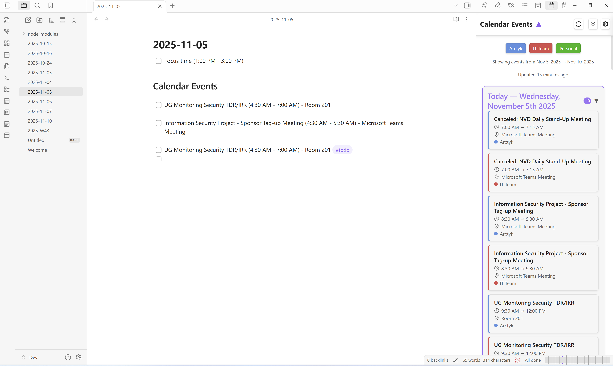
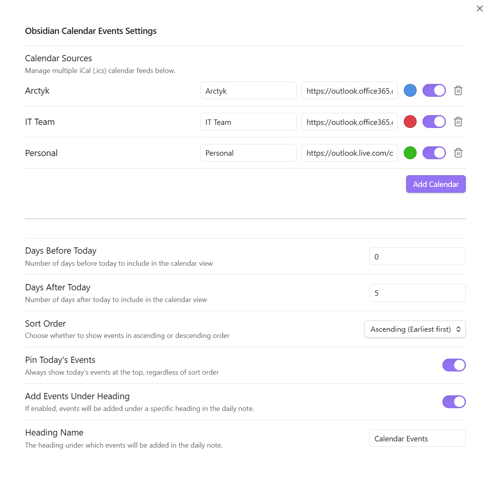

# Calendar Events

<p align="center">
  <a href="https://github.com/ArctykDev/obsidian-calendar-events/releases">
    
  </a>
  <a href="https://github.com/ArctykDev/obsidian-calendar-events/actions/workflows/build.yml">
    
  </a>
  <a href="https://github.com/ArctykDev/obsidian-calendar-events/blob/main/LICENSE">
    
  </a>
</p>


A plugin that displays iCal (.ics) calendar events in a dedicated Obsidian sidebar panel. Connect any number of public ICS feeds — Google Calendar, Outlook, Apple Calendar, SharePoint — and see your upcoming events without leaving Obsidian.

View the full [CHANGELOG.md](CHANGELOG.md) for version history.

---

### Calendar View



### Settings View



---

## ✨ Features

- 📅 Events from any public iCal (.ics) feed, grouped and sorted by day
- 📆 Multiple calendars with individual colour coding and visibility toggles
- 🔍 Real-time search — filter events by title, location, or description
- 🔗 Meeting link support — clickable URLs for Zoom, Teams, Google Meet
- 📝 Event descriptions shown on each card (3-line preview)
- 🗃️ Pin today’s events to the top regardless of sort order
- ✅ Add events to your daily note as tasks with one click
- ⏱️ Configurable date range (days before and after today)
- 🔄 Auto-refresh — keep the calendar current in the background
- ↕️ Collapsible day sections with persistent state
- ⚙️ Test URL button per calendar to validate your ICS feed before saving
- 🎨 Show/hide individual card fields (location, description, URL, calendar name)
- 📱 Works on desktop and mobile

---

## 🧩 How It Works

This plugin reads events from one or more iCal (ICS) URLs and displays them in a dedicated sidebar panel. Events are parsed locally — including recurring events, all-day events, and timezone-aware times — grouped by day, and presented in a clean, readable layout.

No authentication is required. Only public ICS export URLs are supported.

---


## 🛠 Installation

### Option 1: Community Plugins (recommended)

1. Open **Settings → Community Plugins → Browse**.
2. Search for **Calendar Events**.
3. Click **Install**, then **Enable**.

### Option 2: Install via BRAT (for beta testing)

1. Install and enable [BRAT](https://github.com/TfTHacker/obsidian42-brat) in Obsidian.
2. Open the BRAT settings and add this repository:

   ```
   ArctykDev/obsidian-calendar-events
   ```

3. BRAT will install and keep the plugin up to date automatically.

### Option 3: Manual installation

1. Download the latest release from the [Releases page](https://github.com/ArctykDev/obsidian-calendar-events/releases).
2. Copy `main.js`, `manifest.json`, and `styles.css` into your vault's plugin folder:

   ```
   <vault>/.obsidian/plugins/ical-calendar-events/
   ```

3. Reload Obsidian and enable **Calendar Events** from the Community Plugins list.

### Option 4 — Build from source

```bash
git clone https://github.com/ArctykDev/obsidian-calendar-events.git
cd obsidian-calendar-events
npm install
npm run build
```

Copy the output files (`main.js`, `manifest.json`, `styles.css`) into your vault's plugin folder.

# Support

If you have questions or want to request a feature, visit the [Discussion board](https://github.com/ArctykDev/obsidian-calendar-events/discussions).

For full documentation, visit the [GitHub repository](https://github.com/ArctykDev/obsidian-calendar-events).

# Follow me

Interested in a project management plugin? Check out my other Obsidian plugin: [Project Planner](https://projectplanner.md)

- Project Planner repo: [github.com/ArctykDev/obsidian-project-planner](https://github.com/ArctykDev/obsidian-project-planner)